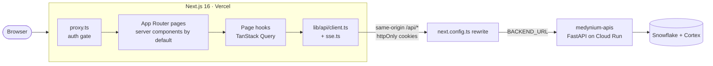
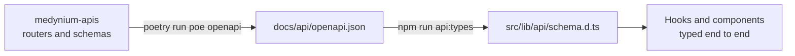

# Medynium UI

**The clinical workstation for Medynium: one Patient 360 screen, an evidence-first AI assistant, and a full audit trail.**

A doctor opens a patient, sees the medications, labs, claims and timeline in one place, and can ask the assistant a question. Every statement in the answer carries a tag and opens a **Why?** panel showing the exact record or label text behind it.

> Synthetic data only. Decision support, not diagnosis. Built for the Snowflake CoCo CLI Hackathon 2026.

This is the Next.js front end. It never talks to Snowflake: the only thing it calls is the FastAPI backend in the sibling repo, `medynium-apis`.

## What you can do

| Screen | Route | What it gives you |
| --- | --- | --- |
| Sign in | `/sign-in`, `/invite/[token]` | Password sign-in, optional email code, invite and reset links |
| Dashboard | `/dashboard` | Worklist, what changed, utilisation, and a "Brief me" summary |
| Patients | `/patients`, `/patients/[patientId]` | Live search with server-side paging and filters. A patient workspace with Overview, Timeline, Medications, Labs, Claims, Notes and Safety review tabs |
| Knowledge | `/knowledge` | Drug label search with full citations |
| Activity | `/activity` | The signed-in user's own audit log |
| Admin | `/admin`, `/admin/users`, `/admin/invites` | Health, users and entitlements, invites (admin doctors only) |
| Assistant | collapsible panel and command bar | Ask in plain words; watch the steps stream in; open the Why? evidence drawer |

Workstation touches: collapsible sidebar, command palette, focus mode, resizable assistant, light and dark themes, and a mobile tab bar.

## Principles the UI holds to

- **Evidence everywhere.** Each answer statement shows whether it is a patient fact, a retrieved source or an AI synthesis, and opens the Why? panel without needing hover.
- **Manual parity.** Every agent action has a manual control. The workspace stays fully usable when the assistant is collapsed or failing.
- **Denied looks like missing.** A patient you cannot open renders the same not-found state as one that does not exist.
- **Synthetic-data banner** on every screen that shows patient data.
- **Every data screen has four states:** loading, empty, error with retry, and agent unavailable.
- **Accessible by default:** keyboard reachable, WCAG contrast checked in both themes, no hover-only content.

## Architecture



The browser only ever calls its own origin. `next.config.ts` proxies `/api/*` to `BACKEND_URL`, so the session cookie is first-party and no CORS setup is needed.

### Types flow from the API



Change the API first, regenerate, then build the UI on the generated types. Never edit `schema.d.ts` by hand.

### Folder layout

```text
src/
  proxy.ts                  auth gate (Next 16's name for middleware)
  app/
    (auth)/                 sign-in, invite and reset
    (workstation)/          dashboard, patients, knowledge, activity, admin
      patients/[patientId]/
        page.tsx            thin: reads params, composes components
        components/         used only by this page
        hooks/              the only place that calls the API client
        lib/  types.ts      page-specific helpers and view-models
        README.md           context card for this page
    dev/components/         component gallery (404 in production)
  features/                 cross-page features: session, evidence, agent-panel
  components/ui/            shadcn/ui primitives only
  components/shared/        used by two or more pages
  lib/                      api client, SSE, env, formatting; no UI
docs/design/                design direction, component specs, accessibility pass
docs/quality/               manual parity checklist and test evidence
```

Each page folder is self-contained and carries a README card (purpose, endpoints used, requirement IDs, states handled). ESLint enforces the boundaries: no imports across route folders, and components never call `fetch` or the API client.

## Tech stack

| Area | Choice |
| --- | --- |
| Framework | Next.js 16 (App Router), React 19, TypeScript (strict) |
| Styling | Tailwind CSS 4, design tokens in `src/app/globals.css` |
| Components | shadcn/ui on Base UI, Lucide icons, Framer Motion |
| Data | TanStack Query, Zod, types generated by `openapi-typescript` |
| Quality | ESLint, Prettier (Tailwind class sorting), Vitest with Testing Library, contrast checker, Husky and lint-staged |
| Hosting | Vercel, with the API on Google Cloud Run |

## Quick start

Requirements: Node 22 (see `.nvmrc`) and npm.

```bash
npm install
cp .env.example .env.local     # Windows: copy .env.example .env.local
npm run dev                    # http://localhost:3000
```

Start the backend first (`poetry run poe dev` in `medynium-apis`) and add `REFRESH_COOKIE_PATH=/api/auth` to its `.env`. The browser reaches the API under `/api`, so the refresh cookie must be scoped to that path or sessions cannot renew. Then sign in with a demo account; the credentials are in `~/.medynium/demo_credentials.txt`, outside the repo.

### Environment

| Variable | Where | Purpose |
| --- | --- | --- |
| `BACKEND_URL` | server only | The FastAPI base URL that `/api/*` is proxied to. `http://localhost:8000` locally; the Cloud Run URL on Vercel |
| `NEXT_PUBLIC_APP_NAME` | client-safe | App name in the page title and header |

Only `NEXT_PUBLIC_*` variables may be read in the browser.

## Daily commands

| Command | What it does |
| --- | --- |
| `npm run dev` | Dev server (Turbopack) |
| `npm run check` | ESLint, Prettier check, `tsc`, Vitest and the contrast check. Run before every commit |
| `npm run test:watch` | Vitest in watch mode |
| `npm run contrast` | WCAG contrast of every colour-token pair, both themes |
| `npm run api:types` | Regenerate API types from `../medynium-apis/docs/api/openapi.json` |
| `npm run format` | Prettier |
| `npm run build` | Production build |

## Quality at a glance

From the backend's latest [test report](../medynium-apis/docs/quality/test-report.md): 78 UI tests passing, contrast 52 of 52 token pairs, and Lighthouse accessibility 100 on the component gallery (both themes), sign-in and the invalid-invite page. The manual parity checklist is in [docs/quality/](docs/quality/manual-parity-checklist.md).

## Deploy (Vercel)

1. Import the GitHub repo in Vercel; it is detected as Next.js.
2. Set `BACKEND_URL` to the deployed API (no trailing slash) and optionally `NEXT_PUBLIC_APP_NAME`.
3. Add the Vercel URL to `CORS_ORIGINS` on the backend only if the browser ever calls the API directly. The proxy does not need it.

All external accounts, keys and decisions are listed in `medynium-apis/docs/external-dependencies.md`.

## More

- [AGENTS.md](AGENTS.md): working rules for contributors and AI sessions
- [Design direction](docs/design/design-direction.md), [component specs](docs/design/component-specs.md), [accessibility pass](docs/design/usability-and-accessibility-pass.md)
- `medynium-prototype.html` (in the workspace root) is a behaviour reference, not the visual target
