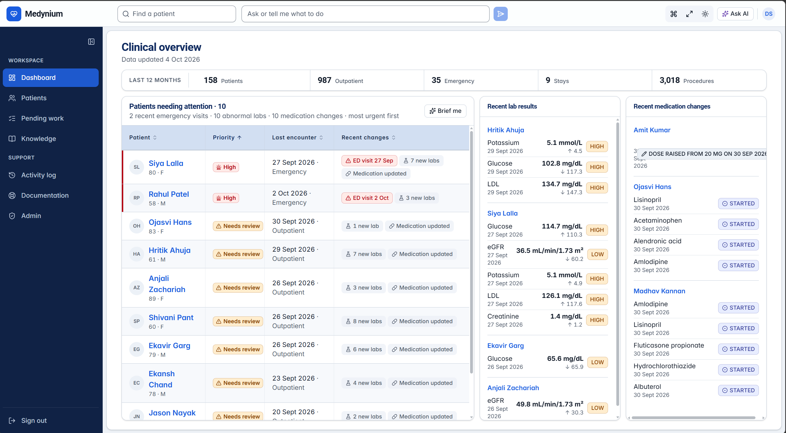
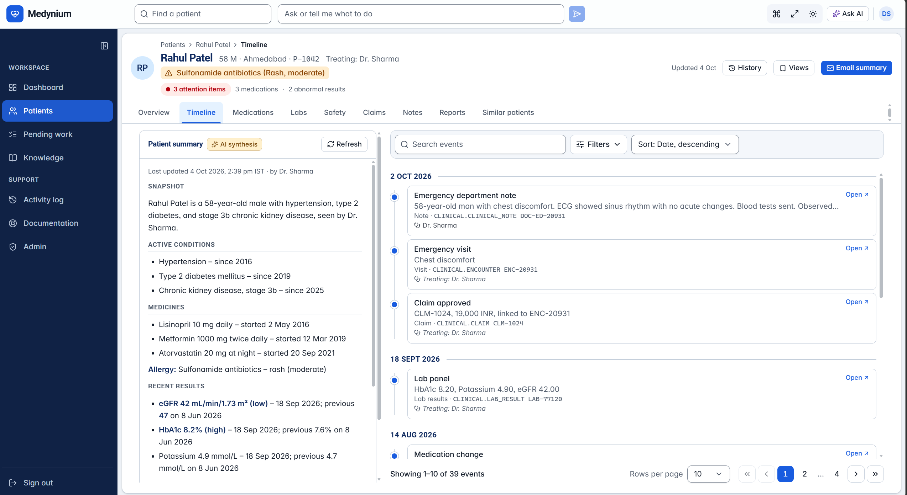
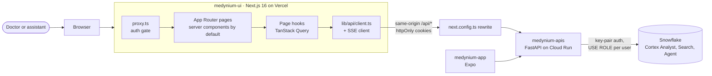
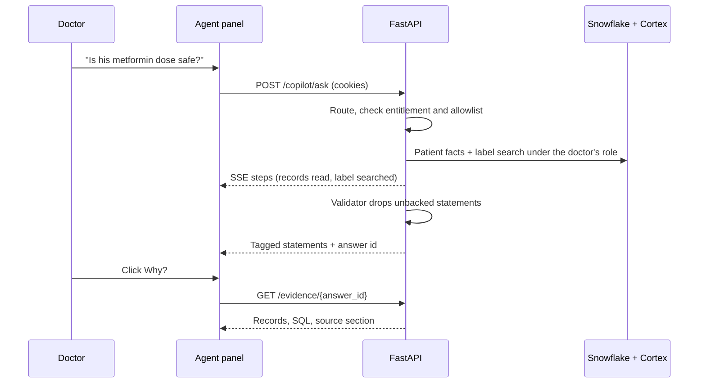
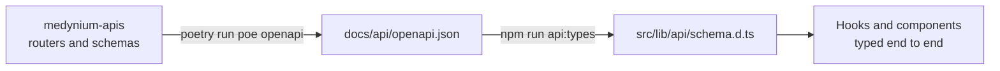

<div align="center">

<!-- MEDIA: logo or banner. Suggested file: docs/media/banner.png (1600x400) -->


# Medynium

### The clinical workstation where every AI answer shows its evidence.

One Patient 360 screen. An assistant that can only see what the signed-in doctor may see. A "Why?" behind every statement.


**[Live demo](#see-it-in-action)** · **[Watch the 3-minute tour](#see-it-in-action)** · **[API repo](../medynium-apis)** · **[Mobile repo](../medynium-app)**

</div>

> **Synthetic data only. Decision support, not diagnosis.** Built for the Snowflake CoCo CLI Hackathon 2026 (Problem Statement 4: Patient 360 and Clinical Document Copilot).

---

## Table of contents

1. [Why Medynium](#why-medynium)
2. [See it in action](#see-it-in-action)
3. [Impact](#impact)
4. [What you can do](#what-you-can-do)
5. [Feature deep dive](#feature-deep-dive)
6. [Trust by design](#trust-by-design)
7. [Architecture](#architecture)
8. [Tech stack](#tech-stack)
9. [Quick start](#quick-start)
10. [Project structure](#project-structure)
11. [Quality at a glance](#quality-at-a-glance)
12. [Deploy](#deploy)
13. [Roadmap and honest limits](#roadmap-and-honest-limits)
14. [The Medynium repositories](#the-medynium-repositories)
15. [Documentation](#documentation)

---

## Why Medynium

A clinician has minutes per patient. The facts they need live in different places: the medication list in one system, lab trends in another, the drug label in a PDF, the last discharge note buried in a chart. AI can help, but an answer that cannot show where it came from is not usable in a care setting, and an AI that can see more than its user is a privacy incident waiting to happen.

| The problem                               | What it costs                                     | What Medynium does                                                                                             |
| ----------------------------------------- | ------------------------------------------------- | -------------------------------------------------------------------------------------------------------------- |
| Patient facts are scattered               | Time lost assembling context before every consult | One governed **Patient 360** with timeline, medications, labs, claims and notes                                |
| Safety knowledge is buried in documents   | Relevant label warnings are missed or found late  | **Cited drug-label search** and a safety review that combines the patient's data with label text               |
| AI answers cannot be verified             | Clinicians cannot trust or act on them            | A **Why?** panel on every statement: the records, the SQL and the exact source section                         |
| AI can overreach                          | Privacy and safety risk                           | The assistant **inherits the doctor's access**, has a **closed set of actions** and can never write on its own |
| "No result" can be mistaken for "no risk" | False reassurance                                 | **Honest gaps**: "nothing found in the indexed sources" is never worded as "safe"                              |

---

## See it in action

<!-- MEDIA: hero GIF or video link. Suggested: docs/media/hero-demo.gif (about 20 s loop) and a link to the full video. -->
<p align="center">
  
</p>

|                                |                                                                                                                          |
| ------------------------------ | ------------------------------------------------------------------------------------------------------------------------ |
| **Live demo**                  | _Add the deployed Vercel URL here_                                                                                       |
| **3-minute walkthrough video** | _Add the video link here_                                                                                                |
| **Demo accounts**              | Doctor (admin), second doctor and assistant. Credentials are kept outside the repo in `~/.medynium/demo_credentials.txt` |

**The 60-second story.** Open the dashboard and the worklist already shows who changed overnight. Open Rahul Patel, 58, on a rising metformin dose with a falling eGFR. Run the safety review: the steps stream in live, and the answer links the renal consideration to his eGFR trend and to the exact section of the metformin label. Click **Why?** to see the records, the SQL and the source. Then sign in as an assistant who has not been given access to another patient, and watch that patient simply not exist.

<!-- MEDIA: screenshot gallery. Add these files under docs/media/ -->

|                                                                              |                                                                                                        |
| ---------------------------------------------------------------------------- | ------------------------------------------------------------------------------------------------------ |
|                                        |                                                   |
| **Dashboard.** Worklist with change flags, utilisation, one-click "Brief me" | **Patient 360.** Everything about one patient, each value dated and sourced                            |
|                                |                                                                  |
| **Safety review.** Live steps, then tagged statements                        | **Why? panel.** Records, SQL and source label behind a statement                                       |
|                                        |                                     |
| **Assistant.** Ask in plain words, watch the steps, approve what it proposes | **Denied equals missing.** A patient you cannot open is indistinguishable from one that does not exist |

---

## Impact

Medynium is built around three outcomes that matter in real clinical work.

**1. Less time hunting, more time with the patient.**
The dashboard, "Brief me", Pending work and the patient brief answer "who do I see first and what changed?" without opening a single chart. Data screens load in about a second, and none of them needs an AI call.

**2. AI a clinician can actually check.**
Every statement is tagged as a **patient fact**, a **retrieved source** or an **AI synthesis**, and every one opens a Why? panel. If the system has no evidence, the statement is dropped. If it has found nothing, it says so plainly, which protects against the most dangerous failure of clinical AI: false reassurance.

**3. Governance that binds the AI, not only the user.**
Access is enforced inside Snowflake under each person's own role. The assistant therefore cannot retrieve, summarise or even confirm the existence of a patient the doctor cannot open. Every question, action, refusal and denial lands in an audit log the user can read.

Built for the context it serves: Indian brand names resolve to their generic drug, amounts are in INR, and the medicine corpus includes the National List of Essential Medicines.

---

## What you can do

| Screen            | Route                                      | What it gives you                                                                                              |
| ----------------- | ------------------------------------------ | -------------------------------------------------------------------------------------------------------------- |
| Sign in           | `/sign-in`, `/invite/[token]`              | Password sign-in, optional emailed code, invite and reset links                                                |
| Dashboard         | `/dashboard`                               | Worklist with change flags, recent lab and medication changes, utilisation, and a "Brief me" summary           |
| Pending           | `/pending`                                 | One list of open findings, follow-ups, unreviewed abnormal labs and recent emergency visits, most urgent first |
| Patients          | `/patients`, `/patients/[patientId]`       | Live search with server-side paging and filters, and the patient workspace                                     |
| Patient workspace | tabs                                       | Overview, Timeline, Medications, Labs, Claims, Notes, Safety, Reports, Similar                                 |
| Knowledge         | `/knowledge`                               | Drug-label search with full citations, brand and typo resolution, and a coverage request flow                  |
| Activity          | `/activity`                                | The signed-in user's own audit log, filterable, with a link back to each Why?                                  |
| Documentation     | `/docs`                                    | In-app guide to how the workstation and assistant behave                                                       |
| Admin             | `/admin`, `/admin/users`, `/admin/invites` | Health, users and entitlements, invitations, knowledge coverage (admin doctors only)                           |
| Assistant         | collapsible panel and command bar          | Ask in plain words, watch steps stream in, open Why?, approve or discard proposals                             |

Workstation touches: collapsible sidebar, command palette (`Ctrl/Cmd + K`), focus mode, resizable assistant, light and dark themes, and a mobile tab bar.

---

## Feature deep dive

### Patient 360

A single workspace per patient with nine tabs. Every value carries its date and source, each medicine shows whether a drug label is indexed, and the allergy banner is always visible. Lab values link to their trend; timeline events open the underlying record. Filters and tabs live in the URL, so a reload or the back button returns you exactly where you were.

<!-- MEDIA: docs/media/patient-timeline.png and docs/media/lab-trend.png -->


### Evidence-first safety review

The flagship workflow. The review reads the patient's medicines, labs and diagnoses, searches the matching drug-label sections, and streams each step as it happens. The answer is a short set of statements, each tagged and backed. A control patient with nothing to find gets an explicit "no documented consideration found in the indexed sources", and a patient whose medicine has no indexed label gets an honest gap, never an implied all-clear.

### The Why? panel

Opens from any tagged statement, by click or keyboard, never hover-only. It lists the patient records (IDs and dates), the SQL that ran, and the source label (title, section, version, effective and retrieval dates). Links are shareable, so a colleague opens the same evidence. Evidence can be pinned to the patient workspace.

### Clinician decisions on findings

A person, never the assistant, raises a finding from a safety statement and decides it: acknowledge, follow up (needs a date), escalate (needs a colleague who also has the patient) or dismiss (needs a reason). The server enforces each rule, and open work surfaces on the Pending page.

### The assistant

Natural language over the open patient and the clinician's own panel: summaries, "what changed since the last visit", current medications, lab trends, label questions and combined safety questions. It can navigate the workspace through four allowed actions and can prepare a new note, allergy, diagnosis or medicine as a **proposal** with a preview. Nothing is saved until the doctor clicks Approve. Prescribing, dosing, cross-patient and population questions are refused with an explanation and audited.

<!-- MEDIA: docs/media/assistant-proposal.png -->


### Reports: from paper to structured record

Upload a PDF or a photo of a lab report or prescription. Rows are extracted with the exact words and page they came from, a patient-name mismatch blocks approval until a doctor confirms, and nothing reaches the record until a doctor accepts, edits or rejects each row and approves the report. Assistants can upload and look; only doctors decide.

### Similar patients

For the open patient, the closest of the clinician's own patients, ranked and explained by shared diagnoses, medicines and abnormal results, with a side-by-side comparison. A comparison aid: it never predicts an outcome and is never padded with unrelated patients.

### Knowledge search

Search drug labels in plain words, by Indian brand name or with a typo. Results are retrieved sections with a full citation and the matched words marked. A drug that is not indexed shows an honest gap with nearby suggestions, and a clinician can request coverage which an admin reviews.

### Audit and accountability

Every question, action, refusal and denial is logged with time, route, model, patient, evidence and outcome, shown as text and not just colour. Doctors can answer "what did the assistant do for me yesterday?" in under a minute.

### Administration

Invite users, disable or re-enable them, reset passwords through one-time links and edit which patients each user can open. Nothing is written until Save, and the user's visible patients change immediately.

---

## Trust by design

Principles the UI holds to, each enforced in code or in review:

| Principle                            | How it shows up                                                                                                        |
| ------------------------------------ | ---------------------------------------------------------------------------------------------------------------------- |
| **Evidence everywhere**              | Each statement shows whether it is a patient fact, a retrieved source or an AI synthesis, and opens Why? without hover |
| **Manual parity**                    | Every agent action has a manual control. The workspace stays fully usable when the assistant is collapsed or failing   |
| **Denied looks like missing**        | A patient you cannot open renders the same not-found state as one that does not exist                                  |
| **Humans decide**                    | The assistant only proposes. Findings, approvals and record changes are doctor actions                                 |
| **Synthetic-data banner**            | Shown on every screen that displays patient data                                                                       |
| **Four states on every data screen** | Loading, empty, error with retry, and agent unavailable                                                                |
| **Accessible by default**            | Keyboard reachable, WCAG contrast checked in both themes, no hover-only content                                        |
| **No secrets in the browser**        | The browser only calls its own origin; only `NEXT_PUBLIC_*` variables are readable                                     |

---

## Architecture

### System view

<!-- MEDIA: optional polished export of this diagram. Suggested: docs/media/architecture.png -->



The browser only ever calls its own origin. `next.config.ts` proxies `/api/*` to `BACKEND_URL`, so the session cookie is first-party and no CORS setup is needed. The UI never talks to Snowflake.

### How an assistant answer reaches the screen



### Types flow from the API



Change the API first, regenerate, then build the UI on the generated types. Never edit `schema.d.ts` by hand.

---

## Tech stack

| Area       | Choice                                                                                                          |
| ---------- | --------------------------------------------------------------------------------------------------------------- |
| Framework  | Next.js 16 (App Router), React 19, TypeScript (strict)                                                          |
| Styling    | Tailwind CSS 4, design tokens in `src/app/globals.css`                                                          |
| Components | shadcn/ui on Base UI, Lucide icons, Framer Motion                                                               |
| Data       | TanStack Query, Zod, types generated by `openapi-typescript`                                                    |
| Streaming  | Server-sent events for assistant steps and the safety review                                                    |
| Quality    | ESLint, Prettier (Tailwind class sorting), Vitest with Testing Library, contrast checker, Husky and lint-staged |
| Hosting    | Vercel, with the API on Google Cloud Run                                                                        |

---

## Quick start

Requirements: Node 22 (see `.nvmrc`) and npm.

```bash
npm install
cp .env.example .env.local     # Windows: copy .env.example .env.local
npm run dev                    # http://localhost:3000
```

Start the backend first (`poetry run poe dev` in `medynium-apis`) and add `REFRESH_COOKIE_PATH=/api/auth` to its `.env`. The browser reaches the API under `/api`, so the refresh cookie must be scoped to that path or sessions cannot renew. Then sign in with a demo account; the credentials are in `~/.medynium/demo_credentials.txt`, outside the repo.

### Environment

| Variable               | Where       | Purpose                                                                                                        |
| ---------------------- | ----------- | -------------------------------------------------------------------------------------------------------------- |
| `BACKEND_URL`          | server only | The FastAPI base URL that `/api/*` is proxied to. `http://localhost:8000` locally; the Cloud Run URL on Vercel |
| `NEXT_PUBLIC_APP_NAME` | client-safe | App name in the page title and header                                                                          |

### Daily commands

| Command              | What it does                                                                          |
| -------------------- | ------------------------------------------------------------------------------------- |
| `npm run dev`        | Dev server (Turbopack)                                                                |
| `npm run check`      | ESLint, Prettier check, `tsc`, Vitest and the contrast check. Run before every commit |
| `npm run test:watch` | Vitest in watch mode                                                                  |
| `npm run contrast`   | WCAG contrast of every colour-token pair, both themes                                 |
| `npm run api:types`  | Regenerate API types from `../medynium-apis/docs/api/openapi.json`                    |
| `npm run format`     | Prettier                                                                              |
| `npm run build`      | Production build                                                                      |

---

## Project structure

```text
src/
  proxy.ts                  auth gate (Next 16's name for middleware)
  app/
    (auth)/                 sign-in, invite and reset
    (workstation)/          dashboard, pending, patients, knowledge, activity, docs, admin
      patients/[patientId]/
        page.tsx            thin: reads params, composes components
        components/         used only by this page
        hooks/              the only place that calls the API client
        lib/  types.ts      page-specific helpers and view-models
        README.md           context card for this page
    dev/components/         component gallery (404 in production)
  features/                 cross-page features: session, evidence, agent-panel
  components/ui/            shadcn/ui primitives only
  components/shared/        used by two or more pages
  lib/                      api client, SSE, env, formatting; no UI
docs/design/                design direction, component specs, accessibility pass
docs/quality/               manual parity checklist and test evidence
docs/media/                 screenshots, GIFs and the banner used by this README
```

Each page folder is self-contained and carries a README card (purpose, endpoints used, requirement IDs, states handled). ESLint enforces the boundaries: no imports across route folders, and components never call `fetch` or the API client.

---

## Quality at a glance

Figures from the backend's latest [test report](../medynium-apis/docs/quality/test-report.md), run against a real Snowflake account and seeded users.

| Check                                | Result                                                                                                                           |
| ------------------------------------ | -------------------------------------------------------------------------------------------------------------------------------- |
| Golden question set (cited answers)  | 19 of 19                                                                                                                         |
| Prompt-injection set                 | 12 of 12                                                                                                                         |
| Retrieval over the drug-label corpus | recall@5 of 1.0, negatives answered honestly                                                                                     |
| Routing set                          | 44 of 47                                                                                                                         |
| Colour contrast (both themes)        | 52 of 52 token pairs                                                                                                             |
| Lighthouse accessibility             | 100 on the component gallery (both themes), sign-in and the invalid-invite page                                                  |
| Speed                                | Data screens in about 1 s. A full safety review reads records and label text, typically 15 to 40 s, with each step streamed live |

The manual parity checklist is in [docs/quality/](docs/quality/manual-parity-checklist.md).

---

## Deploy

### Vercel

1. Import the GitHub repo in Vercel; it is detected as Next.js.
2. Set `BACKEND_URL` to the deployed API (no trailing slash) and optionally `NEXT_PUBLIC_APP_NAME`.
3. Add the Vercel URL to `CORS_ORIGINS` on the backend only if the browser ever calls the API directly. The proxy does not need it.

All external accounts, keys and decisions are listed in [docs/external-dependencies.md](docs/external-dependencies.md) and in `medynium-apis/docs/external-dependencies.md`.

---

## Roadmap and honest limits

**Where we are being candid**

- A full safety review takes tens of seconds because it reads records and label text across several steps. The UI shows progress throughout; speeding it up is active work.
- The drug-label corpus is US labelling, and the coverage report says so. Drugs without an indexed label get an honest gap.
- Report extraction is English only and needs legible print. Handwriting is not supported.
- Similar-patient quality is measured on a proxy only.
- The keyboard and screen-reader walkthrough, and checks at 390 px and 200% zoom, still need a person.

**Next**

- A de-identified analyst role and cohort view, with its own access model
- Alerts and review queues beyond the Pending page
- Broader label and regulatory-document coverage
- A native point-of-care app: see [medynium-app](../medynium-app)

---

## The Medynium repositories

| Repo                              | What it is                                                |
| --------------------------------- | --------------------------------------------------------- |
| **medynium-ui** (this repo)       | Next.js clinical workstation                              |
| [medynium-apis](../medynium-apis) | FastAPI backend, Snowflake setup SQL, Cortex agent, evals |
| [medynium-app](../medynium-app)   | React Native (Expo) mobile client on the same API         |

---

## Documentation

- [AGENTS.md](AGENTS.md): working rules for contributors and AI sessions
- [Design direction](docs/design/design-direction.md), [component specs](docs/design/component-specs.md), [accessibility pass](docs/design/usability-and-accessibility-pass.md)
- [Manual parity checklist](docs/quality/manual-parity-checklist.md)
- [Media shot list](docs/media/README.md): what to capture for the images above
- Backend: [architecture](../medynium-apis/docs/architecture/overview.md), [AI layer](../medynium-apis/docs/architecture/ai-layer.md), [security and access](../medynium-apis/docs/architecture/security-and-access.md)
- `medynium-prototype.html` (in the workspace root) is a behaviour reference, not the visual target
